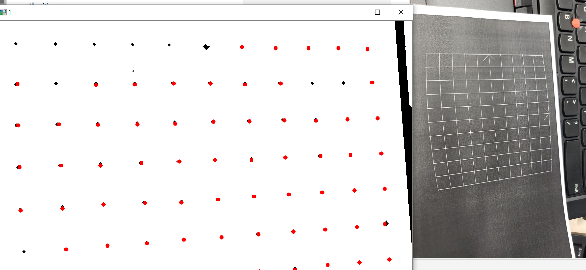

## 交叉点检测
cross point detect  
奕! 悟!  
## 使用方法
运行imCount.py  

## 效果

## 原理
- 二值化:提取高光区域
- 腐蚀+膨胀:可以扩大拐角/缩小拐角   
因为检测区域是十字形状所以使用cv2.MORPH_CROSS会效果拔群  
- 联通区域检测: 腐蚀膨胀之后就剩区域中心点了  
 联通区域检测可以很方便的给出中心点坐标 精确到浮点数
- 备选方案:拐角检测  
中心点并不是拐角 所以拐角检测应该多少会歪掉一点 不是正路
除非能把中心点周围的4个拐角都找到